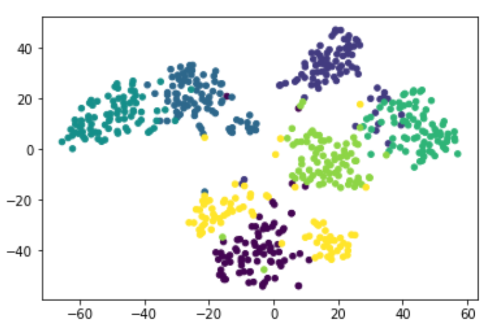
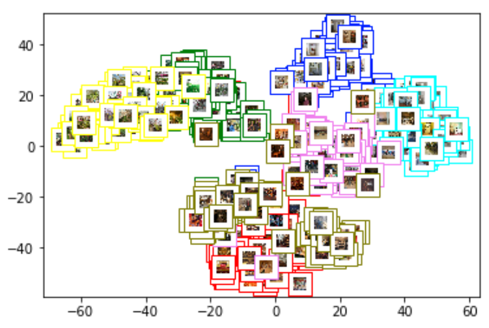

### Contributors:
- Felipe Rojos @farojos
- Felipe Ruiz @feliperuizp

# **Informe Tarea 2**

## 1. **t-SNE**

Se utilizaron las implementaciones para Python de t-sne open source de [Laurens van der Maaten](https://lvdmaaten.github.io/tsne/).

Para realizar el método de clustering t-sne, se utilizaron labels del 0 al 6 ya que hay 7 categorías de imágenes. Los Feats de las imágenes se utilizaron como X, con un preprocesamiento: para poder introducirlos a la implementación utilizada, se normalizaron los vectores entre 0 y 1 y se transformaron los vectores en numpy.array .

[Código de la pregunta](https://github.com/feliperuizp/tarea3_bigData/blob/master/Pregunta1/tsne.ipynb)

Los resultados de los cluster son los siguientes:

### i) Gráfico 2D en que los puntos de cada clase son dibujados de un color diferente ###

### ii) Gráfico 2D en que cada punto es graficado usando como ícono la imagen correspondiente además de un contorno del color de su clase ###

#### Comentarios ####

Cada vez que se ejecuta el t-SNE resulta en datos distintos. Se realizó varias veces hasta minimizar el error en 0.824451. El gráfico también varia levemente.

Respecto al clustering, se reducen los feats de dimensionalidad 4096 a dimensionalidad 2 y se aprecian resultados bastante buenos. Prácticamente todos los clusters están claramente identificados, a excepción del cluster amarillo (gráfico i) o verde militar (gráfico ii). Se logra una visualización de gran calidad.

## 2. **Flume**

## 3. **Spark Streaming**