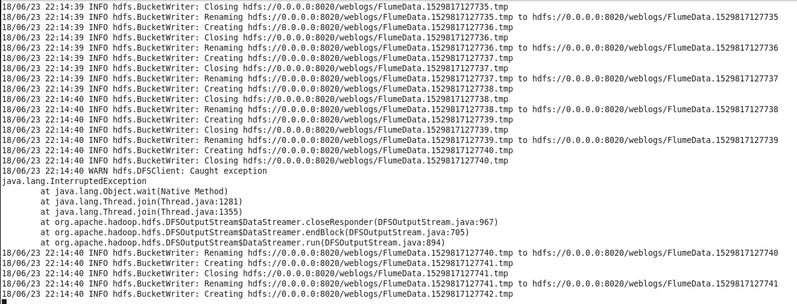
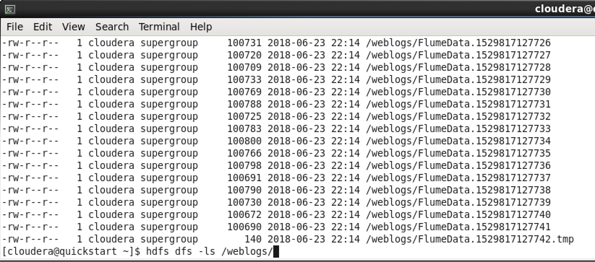
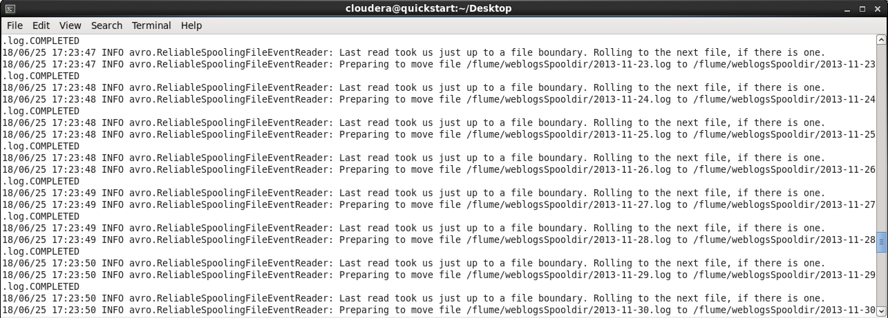
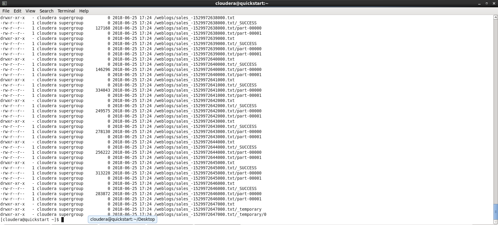
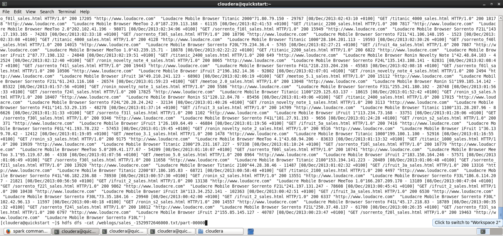

### Contributors:
- Felipe Rojos @farojos
- Felipe Ruiz @feliperuizp

# **Informe Tarea 2**

## 1. **t-SNE**

Se utilizaron las implementaciones para Python de t-sne open source de [Laurens van der Maaten](https://lvdmaaten.github.io/tsne/).

Para realizar el método de clustering t-sne, se utilizaron labels del 0 al 6 ya que hay 7 categorías de imágenes. Los Feats de las imágenes se utilizaron como X, con un preprocesamiento: para poder introducirlos a la implementación utilizada, se normalizaron los vectores entre 0 y 1 y se transformaron los vectores en numpy.array .

[Código de la pregunta](https://github.com/feliperuizp/tarea3_bigData/blob/master/Pregunta1/tsne.ipynb)

Los resultados de los cluster son los siguientes:

### i) Gráfico 2D en que los puntos de cada clase son dibujados de un color diferente ###


### ii) Gráfico 2D en que cada punto es graficado usando como ícono la imagen correspondiente además de un contorno del color de su clase ###


#### Comentarios ####

Cada vez que se ejecuta el t-SNE resulta en datos distintos. Se realizó varias veces hasta minimizar el error en 0.824451. El gráfico también varia levemente.

Respecto al clustering, se reducen los feats de dimensionalidad 4096 a dimensionalidad 2 y se aprecian resultados bastante buenos. Prácticamente todos los clusters están claramente identificados, a excepción del cluster amarillo (gráfico i) o verde militar (gráfico ii). Se logra una visualización de gran calidad.

## 2. **Flume**

Siguiendo las instrucciones fue sencillo de usar, aunque se debio usar una modificacion del enunciado original, el cual usaba el flag --conf que no permitia usar. Además, tuve que tener cuidado con mandar los archivos a HDFS y no a local.

Respecto al la tranferencia de los archivos, podemos ver: 


Respecto a los archivos en HDFS, podemos ver: 


[Archivo de configuración de Flume](https://github.com/feliperuizp/tarea3_bigData/blob/master/Pregunta2/myConfigFileName.conf)

## 3. **Spark Streaming**

Para poder realizar esta pregunta, se cambio el archivo de configuracion de flume. Además se necesito investigar respecto al manejo de streaming en spark (en las clases solo aparece manejos de RDD y no de DStream). Dentro de estos no logre ignorar los RDD de un DStream que fueran vacios, por lo cual genero mucha data persistida en hdfs que se encuentra vacia. Otro problema, fue comprender que spark se ejecuta sobre clusters, y para ejecutarlo en local se debe ejecutar un worker (y el master).

Comando para correr spark:

``` spark-submit --jars '/home/cloudera/Desktop/spark-streaming-flume-assembly_2.11-2.3.1.jar' --master local[2] sparkScript.py localhost 54321 ```

Como comentario, se agrego el jar de streaming entre flume y spark para evitar problemas (use el jar de la documentación encontrada). El flag --master local[2] me permite ejecutar en local 2 threads, uno que escuche el streaming y el otro que corra el worker (vease documentacion cloudera [cloudera docs](https://www.cloudera.com/documentation/enterprise/5-5-x/topics/spark_streaming.html)).

Al igual que el caso anterior, flume se corre con el mismo comando:

``` flume-ng agent --conf-file sparkStreamingFLUME.conf --name hw3Flume ```
 
 Respecto a los resultados, en la siguientes imagenes tenemos:
 
 * FLume enviando los archivos a spark: 
 

 * El resultado despues del filtrado de spark, recordar que archivos sin peso son archivos vacios: 
 
 
 * El contenido de un archivo que no esta vacio y que solo tiene los logs en los cuales aparece la palabra sales: 
 
 
 Se uso código base de word count de flume con spark: [Código base](https://github.com/apache/spark/blob/master/examples/src/main/python/streaming/flume_wordcount.py)
 
 Respecto a la implementación, tenemos:
 
 * Python script: 
 [Script](https://github.com/feliperuizp/tarea3_bigData/blob/master/Pregunta3/sparkScript.py)
 * Flume config file: 
 [Configuracion](https://github.com/feliperuizp/tarea3_bigData/blob/master/Pregunta3/sparkStreamingFLUME.conf)
 
 
Se elimino el split de palabras del archivo de ejemplo, y se hace map con key igual a un identificador unico (UUID v4 {random}). En el filtrado, se filtró con el comando filter, y posterior a eso se hice el map y reduceByKey sobre las lineas filtradas(es equivalente a haber usado filter y reduce solo ) y sobre eso se guardan los rdd resultantes. Respecto a este resultado, cabe destacar que en el reduce se suman los strings sin agregar un salto de linea, lo cual queda reflejado en el screenshot del archivo guardado en hdfs.
 
 Por ultimo, todo código esta linkeado al repositorio y adjuntado en conjunto con este informe
 

 
